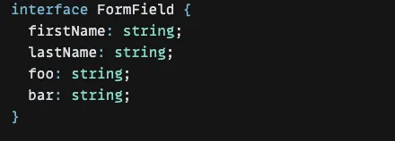
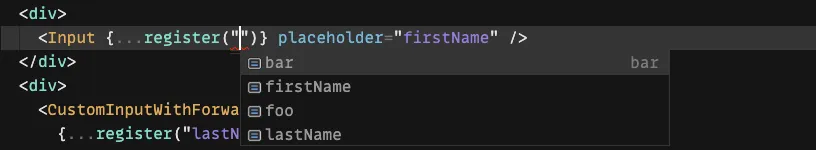
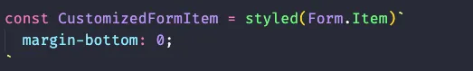

> Photo by [Adrien Olichon](https://www.pexels.com/zh-tw/@adrien-olichon-1257089?utm_content=attributionCopyText&utm_medium=referral&utm_source=pexels) on [Pexels](https://www.pexels.com/zh-tw/photo/5091783/?utm_content=attributionCopyText&utm_medium=referral&utm_source=pexels)

有一次剛好跟同事聊到 **「我們認為的」** ant design form 的缺點，像是是串接非 antd 或者較為複雜的 component 時可能要使用 render props 導致 JSX 會比想像中的難閱讀又或者是對於 form value 型別保障以及讓我們最痛苦的 Form.Item 的內建樣式。

讓我們開始思考有沒有更簡單優雅的方法讓我去使用做表單元件。

以下文章所提到的 ant design form 是指在 ant-design 這個 package 裡面的 Form 元件。

先打個預防針：「沒有絕對好的解決方案，只有適不適合而已」

## TL;DR

比起 antd form 我更喜歡 react hook form 有以下三個原因：

1. 語法較為簡潔且在綁定元件時多數情況下不影響我 component 的 layer
2. 型別系統較為完善
3. 沒有內建樣式

## 當初使用 ant design form 的原因

雖然當初技術選型時我並沒有參與，但我想應該是因為想說就用 ant design 做為主要的 UI library 了，那就使用它內建的 form 吧，最早是在公司內部產品裡使用，因為主要就是一個後台網站所以開發起來並沒有遇到太多的阻礙，頂多偶而 murmur 沒有型別推斷。而且剛好那時也正在從 antd v3 的 form migrate 到 v4 版本（沈醉在將 HOC 的形式改為使用 Hook 的喜悅中）
所以並沒有特別去在意 antd Form 不方便的地方，以當時的時空背景來說是不必花這個成本將 antd Form 換成其他 Form。

為了開發方便，我們就盡量讓每個專案都使用一樣的 technical stack，所以在另外一個面向外部使用者的網頁專案就遇到很多頭痛的問題，而剛好去年下半年的開發能量都放在那邊。

因為大部分後台會用到的元件 antd 都有提供，即使沒有的話可能只要做小部分的改寫，或甚至可以跟設計師協調可不可以不用做得那麼複雜（完美）。

但如果是在開發前台網頁的話在盡量配合設計師的情況下，除了將 antd 元件改寫要費一段心力以外，可能還有 form field 在與「不只是一個單純的 component」進行串接時會很頭痛以及 form 的內建樣式也讓我們感到很厭煩。

所有的小問題全部加起來後，讓我們開發體驗變得十分的糟。

特別說明一下何謂「不只是一個單純的 component」因為 antd form 的綁定機制的關係，如果 Form.Item wrap 的是一個 input 加上一個 div 就會無法綁定成功，而這也代表我們表單狀態的相關實作就是會跟 UI 實作有耦合，所以我如果要成功綁定就是要將這個組合先組成一個 component 或者用 render props 去實現。

我們來看看 ant design 的 Form 是如何綁定 component 的：

```jsx
const [form] = Form.useForm();
<Form form={form}>
  <Form.Item name="name">
    <Input />
  </Form.Item>
</Form>;
```

稍微解釋一下是利用 antd Form 所提供的 custom hook 來產生 form instance，然後將這個 form instance 放入到 Form 元件裡。

`Form.Item` 可以傳入 name 來註冊 form 的 field，然後會將它所 wrap 的元件進行綁定，大致上就是有自動的傳入 onChange 及 value 這兩個 props。

## 那為什麼會選擇 React Hook Form

最一開始只是剛好在逛 github 時瞄到而已，看一下文件後覺得好像蠻有料的感覺是可以解決我們之前在 antd form 遇到的痛點，然後也因爲那時接手的專案算是可以放手使用各種新奇技術的專案，就開始在小部分沒什麼影響的地方開始試用看看。

### 綁定方式

```jsx
const { register, control, handleSubmit} = useForm()
<form onSubmit={handleSubmit()}>
<input {...register('name')} />
<Controller
 render={({ field }) => <input {...field} />}
 name="name"
 control={control}
 defaultValue=""  />
</form>
```

大致上就是使用 `register` 以及 `control` 來進行綁定。基本上 `register` 是用在 input 元件上的。 `register()` 傳入我們要綁定的 field name，而 `control` 的彈性就比較大了，它則是利用 render props 來將 state 與 update state 的 function 傳進 component 裡。

在 `control` 這個例子裡的 field 就包含了 `onChange` 、 `onBlur` 、 `value` 、 `name` 、 `ref` 這些值。通常我們比較常使用到 `onChange` 以及 `value` 也就是我們一般在實作 controlled component 會用到的東西。

從這邊也看的出來我 component 與表單的綁定並不是依賴於 Form.item 這類的東西，而是直接在我要綁定的 component 進行綁定。這樣最大的好處是我的「表單綁定與 UI 沒有了耦合」，在 antd 裡如果遇到有複數個 component 是放在同一 row 之類的排版需求，就會寫得有點醜大概就是：
（而且還沒加上要清除 Form.item 預設樣式的程式碼）

```jsx
<div>
 <Form.item name='name1'>
  <input/>
 </Form.item>
 <Form.item name='name2'>
   <input/>
 </Form.item>
</div>
但換成 React Hook Form

<div>
  <input {...register('name1')}/>
  <input {...register('name2')}/>
</div>
```

總之因為 antd form 的綁定機制我必須一直讓 `Form.item` 影響到我 JSX 中 component 的層級關係，這點降低了不少開發者體驗。

### 型別系統

而真正讓我們愛上 React Hook Form 最主要的原因應該是「型別」，在 React Hook Form 的 `useForm` 可以傳入 generic type 來限制這個 form 能有哪些 field 以及這些 field value 的型別是什麼。

所有相關的 API 都擁有 type 保障，確保我們的 `fieldName` 一定是合法的。以 `register` 為例，接下來註冊元件時就只能使用我們傳入 `useForm` 的 interface 的 key





當然 antd form 他的 `useForm` 也擁有泛型，但最大的問題是我們在 `Form.item` 要寫下 `name=""` 時是無法推斷出這個 formInstance 可以使用哪些 name ，
另外一點是即使 `getFieldsValue` 可以推斷出整個 Form 的型別，但當我 `getFieldValue(fieldName)` 想要取單一個 field 的值時這時他的型別會是 any。並無法利用 `fieldName` 來推導出這個 `fieldValue` 的型別

### 覆寫樣式

在 antd 裡 `Form` 及 `Form.item` 同時處理了樣式與表單狀態， 也就是他們都是有預設樣式的，好處是你不用額外寫什麼樣式這個表單看起來可以整整齊齊。但如果想要有額外的設計時就會必須要一直 override 掉，在後台網站裡並不會有那麼多設計需求，但在給一般的使用者時，當然還是會想辦法讓自己的網站變得比較好看。

但也會導致我們要花很多工在 override 掉 Form 及 Form.item 的樣式，我們主要是使用 styled-component 當作我們的樣式管理，所以在 override 樣式時我們傾向直接重新宣告一個 Styled component：



但寫久了就會覺得，樣式這個東西應該我 form 裡面所控制的元件或者外面容器在控制，到底與 form 有什麼關係。

但在 react hook form 裡，我們就可以把樣式的事情專注在原本寫的 component。

---

這篇文本來是在去年 9 月開始撰寫但一直拖到現在才寫完 ，期間剛好換了工作，也在這裡碰到 material ui + formik 這個組合。

相比之下 Formik 有點像是 antd form 給我的感覺，都會用一個大的 component（Formik）wrap 住一堆 component（field），藉此來提供 form 的 context。

但剛好這一陣子也在將 Formik migrate 成 react hook form，也著手處理一些比較複雜的 form refactor 其中用到了 react hook from 的 FormProvider 、useFormContext 及 useController 這類在拆分 Form 的語法，也許將來有更多 react hook form 相關心得可以分享。
