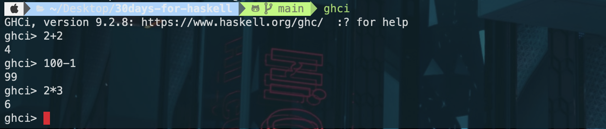
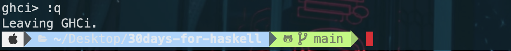
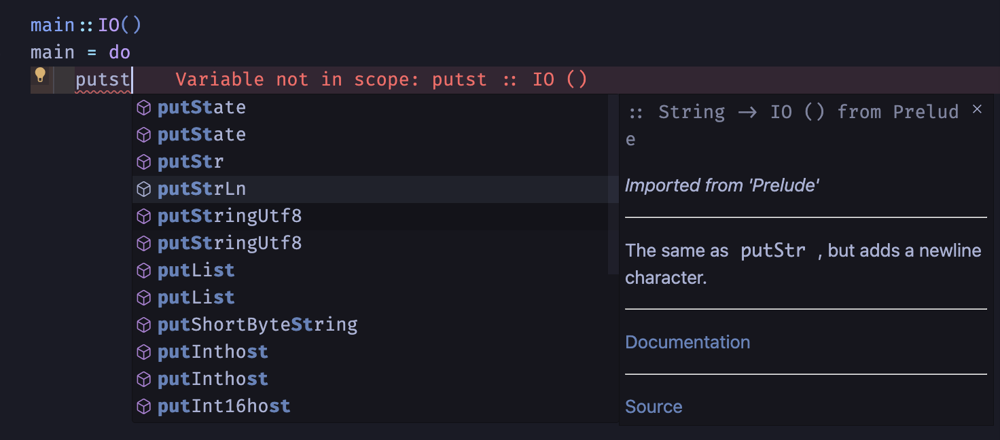
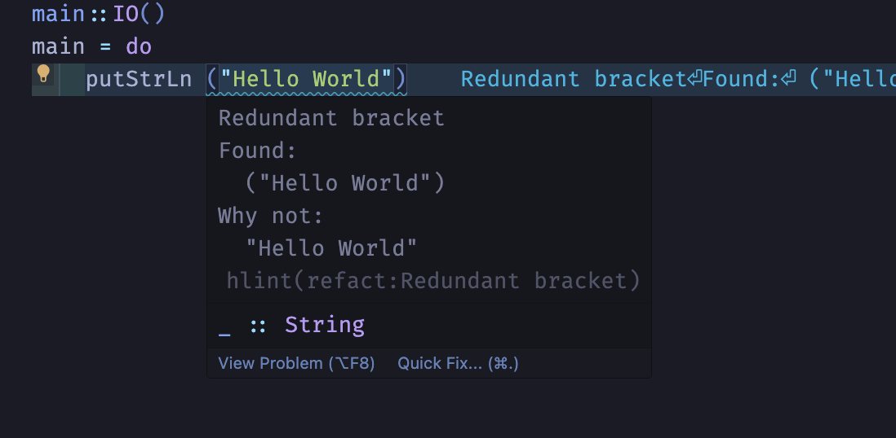
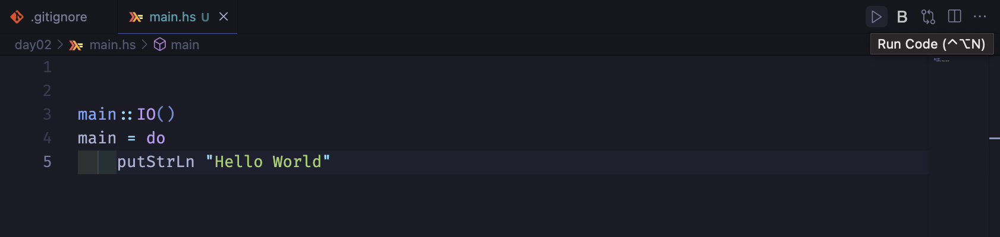
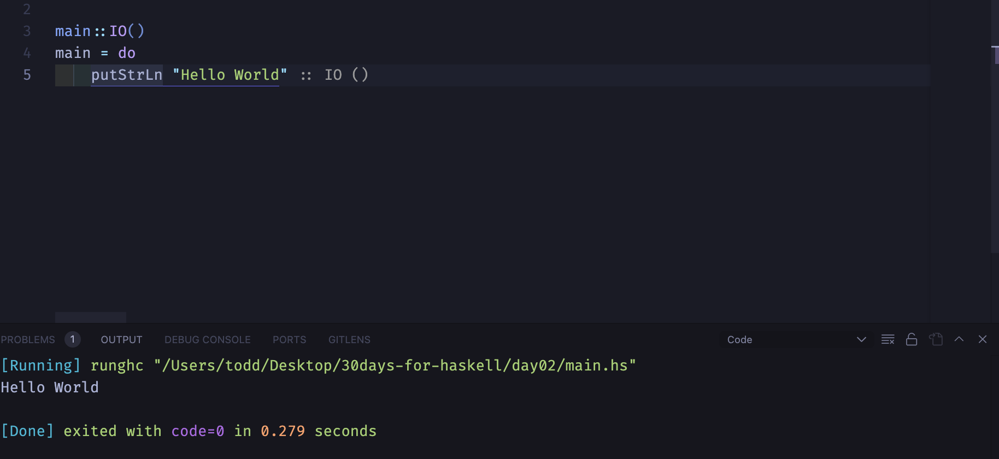

> Photo by João Saplak on <a href="https://www.pexels.com/photo/close-up-of-a-facade-of-a-modern-building-19376412/">Pexels</a>

這系列文主要是重新整理一下今年參加 IT 邦幫忙鐵人賽的文章，畢竟當初為了趕每日發文的挑戰所以其實有些文章的內容有點水（也可能是我本身就寫得很水 xD），如果有興趣的讀者可以參閱一下原本的[系列文](https://ithelp.ithome.com.tw/users/20159893/ironman/6439)

## Haskell 是什麼？

Haskell 是一個非常純粹的函數式程式語言(functional programming language)，它所擁有的一些特性讓我們可以寫出更優雅及抽象的程式，例如：first-class function、immutable、lazy evaluation、typeclass、currying 等等。

但也因為 Haskell 的特性相較於我們開發上常用的語言來說，它更加的學術且學習曲線更為陡峭，但當我們熟悉這些概念後會發現這些特性會讓我們的開發體驗提升許多。

## 為什麼想學 Haskell ？

如果有關注這幾年的前端社群風向會發現「FP」這個詞愈來愈常被提到，而且通常會跟「好維護」、「可讀性高」、「難學」等等標籤扯上關係。

> 我知道有一派人是對於 point-free 或一直用 `.` 來 chaing 感到很礙眼，所以可讀性高不高我覺得是見仁見智，但我覺得整份程式碼的確會有一種精緻的感覺。

但如果要我給一個形容詞來說明 FP 我可能會選擇「優雅」吧，**「我自己感覺」**是在閱讀使用 FP 風格的程式碼較於 OOP 更好閱讀，雖然我可能看不太懂每個 function 的實作但我大概能從 pipe 的順序去推敲出大概是要做什麼事情。

> 特別說明一下，我認為比起 OOP 更好閱讀的原因是因為我覺得 OOP 每一個 class 該負責多少事情這個範圍很難界定，當然我知道有各種方法論可以幫助我們去釐清依賴的程度及方向，但也許是我剛好沒有跟精通 OOP 的人一起共事過導致我無法理解 OOP 的精妙

大概在三年前幸運地下加入到一個非常非常非常非常喜愛 FP 的團隊，熱愛到甚至有用過 PureScript 來開發產品過。但大部分情況下我們還是使用 ts/js 上開發雖然我們一樣可以盡可能地使用 FP 的特性，但總感覺還是離真正的 FP 有種隔層紗的感覺。

也因此讓我萌生了想要好好學習的 FP 的想法，因為種種原因我直到最近才又開始這項學習計畫。這次既然想要好好學習 FP 了不如就直接從最純粹的 Haskell 開始吧，所以與其說這個系列文是要學習 Haskell 不如說我真正的目的是要學習 FP 。

## 開發環境

今天先來輕鬆的開發環境設定

因為 Haskell 是一個靜態語言所以我們勢必需要安裝所需要的編譯器，接下來我們都會使用最主流的 GHC (**Glasgow Haskell Compiler**) 來進行開發。

以下流程皆是使用 `m1 mac` 及 `vs code` 作為示範，但如果沒意外的話各作業系統應該都可以支援 GHCup，特別注意一下 `windows` 是需要在 `WSL2` 進行安裝。

## GHCup

[GHCup](https://www.haskell.org/ghcup/) 是一個幫助我們安裝 GHC 的工具

接下來我們按照官網的指令輸入：

```bash
curl --proto '=https' --tlsv1.2 -sSf https://get-ghcup.haskell.org | sh
```

基本上就是一路按 `enter` 就好，但要特別注意的是如果是要使用 `vs code` （其實只要是支援 LSP 的編輯器）進行開發的讀者，請記得在安裝時記得安裝 `Haskell Language Server`

然後我們就可以在 terminal 上試用看看 Haskell

```bash
ghci
```

然後我們就可以利用這個環境來讓我們簡單的使用 Haskell 。


如果要退出 gchi 只要輸入 `:q` 即可


### vs code 設定

首先推薦安裝幾個 vs code 插件

1. [Haskell](https://marketplace.visualstudio.com/items?itemName=haskell.haskell)
   1. 提供語法檢查、自動補全等等功能
2. [Code Runner](https://marketplace.visualstudio.com/items?itemName=formulahendry.code-runner)
   1. 提供更簡單的 build code 流程
3. [haskell-linter](https://marketplace.visualstudio.com/items?itemName=hoovercj.haskell-linter)
   1. 程式碼格式檢查
4. [Haskell Syntax Highlighting](https://marketplace.visualstudio.com/items?itemName=justusadam.language-haskell)
   1. 語法 hightlight

安裝好後你的 vs code 應該會有類似下面的圖片的功能





特別介紹一下 code runner，安裝好當我們按下右上角的**Run Code**



會直接在下方的 Output 顯示執行結果


### 可能會遇到坑

如果出現以下錯誤

`Consider installing HLS via ghcup or change "haskell.manageHLS" in your settings`

可以試著先看一下自己的 vs code `setting.json` 是否有 `haskell.manageHLS` 的設定

```json
"haskell.manageHLS": "GHCup",
```

如果還是沒辦法，可以試著用 `cabal` 安裝 `haskell-language-server` 看看

```bash
ghcup install cabal 3.10.1.0
cabal install haskell-language-server
```

如果遇到 linter 相關的

可以看一下`setting.json` 有無設定：

```json
"haskell.hlint.executablePath": "hlint",
```
