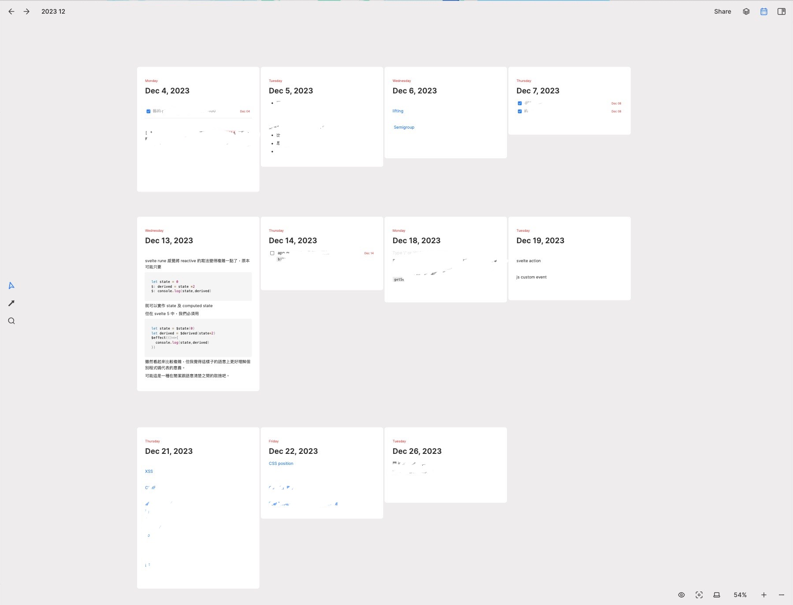

突然覺得半年回顧一次有點太頻繁了也有可能是上半年沒有太多值得書寫的部分，總之這次就一次回顧這一年的變化吧，這次剛好也想把回顧的方式改變一下，除了技術或者工作上以外其實還有蠻多值得紀錄的事情。

## Blog 搬家

今年年初時將原本在 medium 的部落格改成自己架站，詳細的心得可以看之前的[文章](../2023-04-07/)，其實搬家這個念頭一直都存在著，只是缺少了一個衝動而已。

搬家完到現在的心得是：超值得！

除了體驗到前所未有的自由度以及不用忍受對於開發者不太友善的編輯器以外， medium 最近突然加上一個蓋板廣告，讓我非常慶幸還好我先搬出來了。

## 算是有參與一個開源專案

其實我以前也是有在其他比較大的開源專案中開過 PR ，但只有修修文件的 typo 或者改個一兩行的 type 錯誤，因為 blog 搬家這件事情我就有陸續向 [Svelte-QWER](https://github.com/kwchang0831/svelte-QWER) 開幾個 PR ，也因為現在這個 template 還算冷門（或許 svelte-kit 也應該還算是小眾框架）所以基本上 PR 蠻容易被 merge 的，這點讓我覺得很有參與感及成就感的 xD。

## 改善筆記流程

大概在年中時開始重新建構我的筆記流程因此有了這篇[文章](../2023-10-2/)，目前為止我還是繼續用著 heptabase + notion 的工作流。

這樣的組合算是我認為最舒服的配置了，如同我在上面的文章所說到的一樣，把「想法」跟「知識」放在 heptabase ，「資料」就放在 notion 。

然後這陣子最喜歡的用法是上次跟 [PJ](https://pinchlime.com/) 諮詢時學到的一招，就是將建立每個月的 whiteboard ，然後將 journal 放到裡面。這樣子可以總覽一下這個月做了哪些事情、學了哪些東西。

> 也可以一眼就看得出來這個月有多混

## 養成隨身帶相機的習慣

其實我從高中開始就一直有在玩攝影而且還是從數位相機玩回底片相機，但出社會後隨著底片價格愈來愈貴以及愛用的底片相繼停產的情況下我就漸漸放棄這項興趣了，直到去年時購入了 X-T30 II ，我才重拾對於攝影的愛好。

但去年也只有假日出門時才可能會帶著相機，後來想想這樣子實在是有點浪費錢，所以今年買了一顆餅乾鏡 **TTartisan 27mm f2.8** 來讓我可以更有意願帶出門。

不得不說 APS-C 的大小配上餅乾鏡的體積及重量真的非常非常親民，再次印證了這句話「帶的出門的相機，才是好相機」，而且我覺得拿著定焦在街上拍照時比較沒有侵略感，當然這個焦距如果真的要拍稍微特寫一點的話還是要離被攝主體近一點，所以使用上我還是比較常拍景。

> 或許之後可以買個 35 或 50mm 來彌補 xD 。

關於這個鏡頭其他優缺點網路上有蠻多討論了，總之我認為它是一個物超所值的鏡頭。

以下就獻醜放個幾張實拍照，大多是 JPG 直出有些經過裁切。

  

  
  

  

  

## 參加 IT 鐵人賽

今年寫了有關 Haskell 的系列文，其實在參賽前我在「OCaml」、「Elixir」、「Rust」這幾個我都蠻有興趣的語言之間猶豫，我那時想的是我想要好好學習一下 FP 的語言還是研究一下 Rust ，後來想想比起 Rust 也許 FP 是我更常在工作上遇到的領域，所以大概在開賽前兩週才確定就是要寫 Haskell 。雖然說 Rust 也是有支援 FP 的某些常見特性但我覺得可能純粹以「學習」為目的的話，可能直接挑戰最純粹的 FP 會比較有趣（？）

這次的挑戰也讓我終於有動力好好學習以前一直矇矇懂懂的 `Functor`、 `Monad` ，只覺得我好像比以前更了解了它們一點，但好像又產生了更多的疑惑。除了學習新知識以外我覺得更讓我有收穫的是在讀者的留言，這次意外的有大大在關注我的系列文也幫我在留言區補充了很多概念，真的非常感謝。

因為算是臨時起意決定參賽，所以基本上我在開賽前並沒有存多少文章量，也讓我在挑戰期間過得十分忙碌，只能說還好我最後還是完成這項挑戰了，因為我自己認為這應該是我下半年的小小奇異點，如果沒有參賽的話或許以下的事情都不會發生了。

## 稍微認真一點經營 X (twitter)

雖然目前這個 X 帳號也創了一年多了，卻直到今年九、十月才比較有花時間在經營，原本其實只是打算潛水看看技術討論或者新聞之類，但那時剛好完成鐵人賽感覺好像有點讀者在關注我的文章那不如就導流到 X 看能不能多產生一些互動 ，也非常幸運的在 X 上認識一些厲害的開發者，突然覺得自己有跨出這步真的太好了。

原本我對 X 的規劃還是發有關技術的推文居多，只是後來發覺我也沒那麼多技術內容可以分享，所以後來就變成發發牢騷跟技術推文各半（？）在經營。

比較令我意外的事件應該是發了一篇有關筆記流程的文章後突然受到比預期多很多的流量，讓我有點受寵若驚 xD

> 讓我知道要如果想漲粉要寫哪類文章了，誰想看技術相關的文章啊 xD

## 第一次參加 conference

因為今年鐵人賽完賽可以獲得一張 [MWC](https://modernweb.tw/) 的票，心裡想既然都不用錢了就去參加看看吧。這次主要是關注 Rust 、Golang、WASM 及前端領域相關的議程。

但比較有記憶點的議程還是有關 heptabase ，是由他們的團隊分享他們如何建立這個產品。不得不佩服他們在建立團隊文化及開發產品上所花的心血。

另外在每場議程結束都有一個安排講師跟聽眾交流的時間所以這次有跟幾個講者大概交流了一下關於用 Rust 或者 Golang 來開發後端的看法，雖然感覺比起 node.js 難上手很多但聽起來應該都是抱持著靜態語言真香的看法。

原本預計要在 conf 上去跟幾個在 X 上認識的人認親，但身為 I 人的我實在跨不出這一步 xD

## 其他

雖然今年在工作上前端的開發比例減少了一部分，但我平時還是比較喜歡關注前端技術，感覺今年「又」是前端工具的百花齊放的一年，大概兩三年前就有了前端 infra 不用 js 的風氣，那時也出現了 esbuild、swc 之類的工具，而今年前端社群突然出現很多新東西像是 bun 、rspack 、 Turbopack 或是還沒開源的 rolldown 。

> 雖然說 bun 在定義上不算是前端工具。

就我自己的觀察好像使用 Rust 開發的工具似乎還是佔了多數，也讓我覺得 Rust 對於前端的影響力真的愈來愈高了，那可能有人會想問按照這樣子來看 Rust 會影響到我們日常的開發功能嗎？之前在某個 podcast 上聽過尤雨溪聊到關於 Rust 對於前端開發者的影響程度，大意上是對於寫前端工具相關的開發者才會比較有影響，對於要用 Rust 來開發一般的前端功能太折騰人了。

另外在今年前端我比較有關注的還是 Svelte ，今年突然發布了 v5 的新功能 `rune` ，可以看出前端框架們愈來愈偏好 signal 這個概念（除了 React） 雖然有人對於這個改動抱持負面看法像是認為這會讓原本的 reactive 寫法變得不再那麼簡潔。

但我覺得這就是 trade-off 吧，至少它解決了某些情況下 `$:` 無法被觸發的情況，而且我自己是對於 `$:` 沒有抱持太多好感，所以之後改成要用 `$derived` 或者 `$effect` 我是樂觀其成，而且也可以不用看到了 `export let` 這種神奇宣告，但說了那麼多我自己工作上根本沒用到 Svelte 就是了 xD

最後就是 Next.js 及 React 了，其實我對於它們是開始有點由愛生恨的感覺特別是 Next.js ，之前與朋友有聊到 Next.js 愈來愈複雜且多了不少感覺大多數人不太會用到的新功能（或許有可能是單純我自己用不到 QQ）以及對於 react 生態系的走向抱持負面看法感覺 React 已經跟 Next.js 綁死了。

讓我想起之前在 X 有滑到這篇文章 [Why I Won't Use Next.js](https://www.epicweb.dev/why-i-wont-use-nextjs) ，裡面除了提到 Next.js 對於 React 的影響以外，也提到了 next.js 本身的問題像是穩定度或者黑魔法太多之類的。

其實我也是現在才知道原來 React 有類似 server action 的 api ，不得不說這篇文章里提到「Next.js is eating React」這段算是講得蠻貼近的，有時候看到這種與 RSC 相關的語法時可能要想一下到底是 React 還是 Next.js 提供的。

## 2024？

我內心一直有「取之於社群，用之於社群」的想法，但也是直到今年我才開始比較有在與社群交流的感覺，希望明年可以繼續保持這份心情。

在技術學習上應該還是維持著現在的目標，學習 Rust 、Haskell 及 Svelte，至於為什麼是他們三個？

除了上面所提到的 Rust 對於整個前端有十分大的影響力雖然沒寫過這些前端工具的插件但或許學了 Rust 就會想去寫了（？），以及 Rust 本身的語法特性我還蠻喜歡的。

而 Haskell 就單純只是因為對於 FP 的追求所以才去開始學習它，但我覺得我可能不會真正地把它拿來當作開發的工具就是了，目前大概希望早日把鐵人賽的文章整理完，特別是將 `ADT` 、`TypeClass`、`Functor` 、`Monad` 這幾個重要概念重新梳理一遍。

至於 Svelte 我自己是認為多學一個框架總不是什麼壞事，而且感覺目前前端框架的走向都是偏好減少 runtime 把大部份的工作交給編譯器（再說一次，除了 React），像是 Svelte 、 Vue 的 Vapor mode 及 SolidJS 。所以多學習一個不同概念的前端框架也許未來還是有點幫助的吧？

> 這又要說到 React 到底是不是一個「框架」，其實官網上一直都是寫著「React is The library for web and native user interfaces」 ，所以按照這個定義來說感覺 React 這一生應該不會有需要編譯器的一天。
