---  
title: 從 notion 到 obsidian 再回到 notion 最後再加上 heptabase
summary: 'heptabase 讚讚讚'
published: '2023-10-24T12:00:00.000+08:00'
cover: https://r2.toddliao.dev/2023-10-24-cover.webp
coverStyle: 'TOP'
coverCaption: <a href="https://www.pexels.com/photo/close-up-of-architectural-detail-1544943">Photo by Scott Webb</a>
tags:
  - ['雜談','筆記軟體','notion','heptabase','生產力']
---

大概在去年年底，我開始使用了 obsidian 作為我的主要筆記軟體，使用了一陣子後又發現有一些缺點讓我有點無法忍受導致我又換回了 notion ，而在前一陣子遇上了 heptabase 目前知識管理及記事的流程就大致定下來了。

> 這篇文章主要是折騰自己後的心得文，所以關於各軟體的詳細用法並不會解釋太多。
> 

# 我用筆記軟體的目的

如同前面所說就是為了「知識管理」以及「記事」大概分一下細項的話，我一天中會接觸到筆記軟體的事情會有：

1. 日記
2. 工作上的筆記
3. 記錄靈感
4. 收集網路文章
5. 確認待辦事項
6. 寫作
7. 掌控任務進度

這部分我原本在 notion 的做法是把不一樣的紀錄用各種 database 分開存放甚至會把收集文章的database 拆成前端、後端、flutter 之類的主題。

也就是說我先設立一堆架構之後再根據文章種類放進對應的 database，那這樣子的好處是部分滿足我的強迫症，但這也帶來最困擾我的兩個痛點「有時候我根本不知道該把這個筆記放到哪裡」以及「下次我該怎麼利用這份筆記」

雖然結構清晰是好事，但因為 notion 的特性我蠻難一次抓取相關筆記所以我大概只能從各個可能有關 databasa 找找看或者全域搜尋，只是沒有一個在 page 這個概念之上的欄位讓我去 filter ，有點類似 metadata 的概念。

總而言之 notion 讓我可以整理出一個井然有序的筆記庫，但我好像很難再次利用它，所以後來就一直想找方法可以改善的點。

> 雖然後來發現是我自己用 notion 的方法是錯的。
> 

# 為什麼要離開 notion？

一切的起點是我看了一本叫做「卡片盒筆記術」的書，原本我就對於生產力感到焦慮所以那時就覺得這個筆記方法也許對我很有幫助吧。下定決心要開始實踐時就陷入一個寫筆記前的萬年難題「到底該選哪種筆記軟體？」，我自己認為「卡片盒筆記」最為重要的事應該是「連結」這件事情，所以那時就先放棄了 notion 。

> 說來有點好笑，雖然我一直在使用 notion 只是我當時不知道那時 notion 已經有 backlink 這個功能。
> 

大概爬了一些文後就選擇了用 obsidian ，有幾個優點我現在依然覺得蠻棒的

1. 啟動速度以及流暢度比起 notion 快很多很多
2. 寫筆記的阻力比起 notion 小很多
3. 雙向連結
4. 高度客製化及插件生態系

關於流暢度，我相信只要是用過 notion 的人應該相當有感，雖然在公司筆電 m1 macbook pro 上， notion desktop 版依然還算快，但只要一換回我自己的 2017 年的 i5 macbook pro 就會感到相當吃力。後來有聽說 web 版的體驗比較好後就都轉用 web 版了。那 obsidian ****基本上在我兩台筆電上運作的都算順暢。

至於阻力的話，可能是基於個性問題我認為用 notion 寫一份筆記是相當吃力的事情，因為我必須先想一下這份筆記應該放在哪個 database 或者 page 下，他該是一份新的 page 還是記在某個已存在的 page 就好呢？

總而言之這種以 page 作為形式的思考雖然結構嚴謹，但有時候就是真的不知道結構該長怎麼樣所以在寫筆記前總會想很多。但記筆記有時候就是只是為了記錄一閃而過的想法，但每次想筆記的結構都比寫筆記的時間還長。當然 notion 就算事後要改變一個 page 屬於哪個 database 也不是辦不到，但操作起來就是有一點麻煩，所以才會變成一開始就希望放對地方。

而 obsidian 雖然還是 page 為單位而且也有 folder 的概念，但因為沒有 database 所以基本上我可以隨便寫，不用想到底該放在哪，至於 folder 只是整理 page 的存放位置，但就算放在一起也不會有什麼真正的「連結」出現。

也因為在 obsidian 沒有什麼階層概念所以我加上一個標籤不會像 notion 那樣他是屬於在某個 database 的 column ，而算是一整個 vault （obsidian 的儲存單位，可以想像成 root 資料夾就是了）都是範圍的 tag，我只需要打上 tag `#rust` ，那我就可以直接在搜尋欄找出來，不用管它是屬於哪個 database

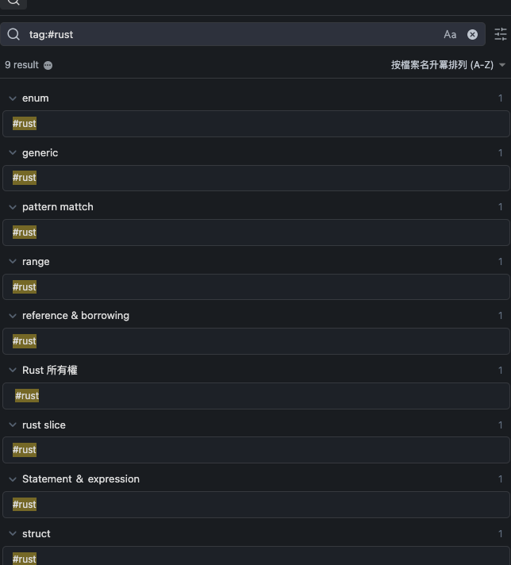

那什麼是雙向連結呢？一般來說寫筆記很常會是根據某個文獻或者另外一份筆記來寫，但有時侯我也想看這份筆記被怎樣使用。這可以讓我閱讀一份筆記時馬上可以找到跟它相關的知識。

以我之前做 rust 筆記為例好了，首先我先寫了一個「Rust 所有權」的筆記，後來有一天我在寫 「struct method 」的筆記時某些部分跟所有權有關只是我可以簡單地使用 backlink 連結回「Rust 所有權」這份 筆記

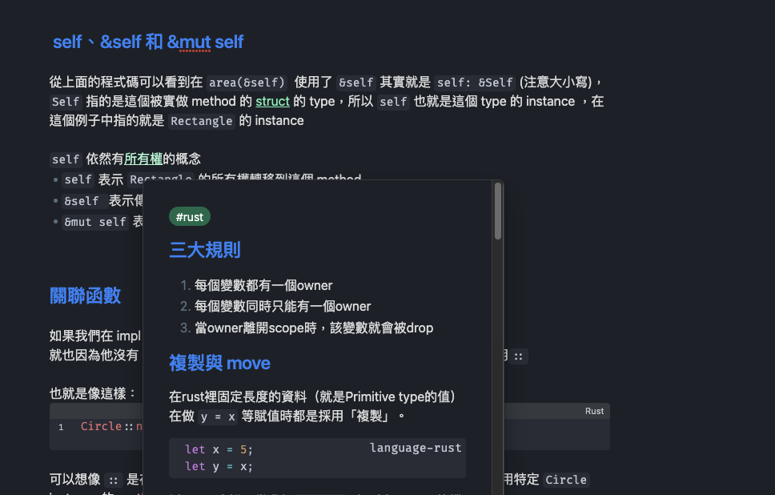

那在「Rust 所有權」裡我也能看到有哪些地方用到了它，所以當我在複習所有權時我就可以順便把相關的知識點都複習了一遍。

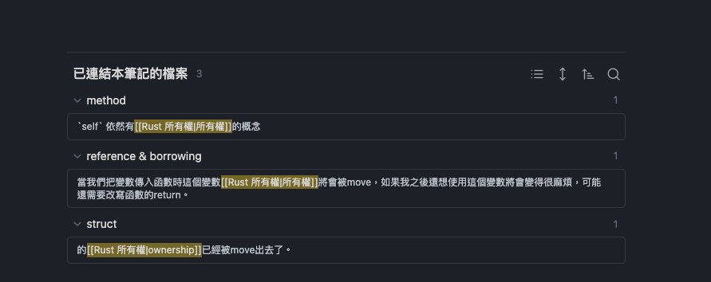

那客製化的部分我覺得比較有感的點是視窗的擺放基本上就是完全可以按自己喜好設定至於插件基本上最常用的就是 git 插件以及主題還有一些小功能像是日曆，最近使用檔案紀錄之類的。

總之 obsidian 對我來說是一個相當不錯的筆記軟體，但還是有些點讓我無法忍受以致於我棄用了。

# 為什麼換回 notion

約莫用了半年大致上體驗還是相當不錯，這時我算是使用 notion + obsidian 的形式在使用， notion 就當作收藏文章使用，畢竟它的 chrome 插件相當好用。然後 obsidian 就做扣除收集文章以外的事情。

但前面有說到我有時候會兩台筆電交叉使用的，其實這點也跟工作型態改變有那麼一點點關係 xD，就是我們公司開始要大家回辦公室了，所以以前其實就算下班在家如果要寫筆記或文章也會使用公司的電腦，但變成大部分時間在辦公室後我算是蠻懶的背電腦回家的人所以如果下班在家要寫筆記就變成必須使用我的舊電腦。

前面有提到 obsidian git 插件這件事情，因為 obsidian 是只有**「本地儲存」**的也就是說如果我沒有特別同步的話我在公司電腦寫的筆記就無法再我自己的電腦上繼續撰寫，反之依然。

那社群主流解法就是利用 git 來當做同步的工具，當然身為一個前端工程師使用 git 也不會是什麼困難的事情，再加上有插件其實我也很少手動下指令。

但是就是這個但是，因為是兩台電腦自動同步（其實就是自動 commit + push ）所以很多時候會遇到 conflict ，大部分原因都是因為我寫完後如果還沒到自動的同步的時間就關掉的話，這就是一個 unstage change  ，所以我用另外一台電腦當然不會有拿到那份筆記，那如果我同時在另外一台電腦寫筆記時，我再次回到第一台電腦時就會遇到 conflict 了。以及 obsidian 有一個本地檔案是紀錄目前 obsidian 的 config ，也就是目前這個 vault 有哪些筆記、視窗設定是什麼等等，所以如果我在另外一台電腦調了一下視窗大小也會導致這個檔案的變動，導致這個檔案也相當常遇到 conflict 。

這點也是我最不舒服的一點，除非我要每次關機前記得要手動同步一次不然隔天就是會遇到 conflict 。久而久之我就放棄使用 obsidian 了轉而回去使用 notion 了。

> obsidian 其實有官方同步方案，但就是貴。
> 

# 逐漸清晰的筆記流程

大多數人使用筆記軟體是要管理自己的知識、工作甚至是生活。但我相信部分的人（至少我是）都是一股腦把全部東西「放起來」而沒有 「整理」過。

回到 notion 第一件事情就是檢討一下自己為什麼之前用不好 notion ，簡單來說還是這兩個問題「有時候我根本不知道該把這個筆記放到哪裡」、「下次我該怎麼利用這份筆記」。

## 筆記的入口

第一步我先建立一個整個筆記系統的入口方便我在各種主題間快速跳轉，這邊我的做法是切分出三個區塊基本上是由使用頻率以及記事的複雜度由簡單到複雜排列。

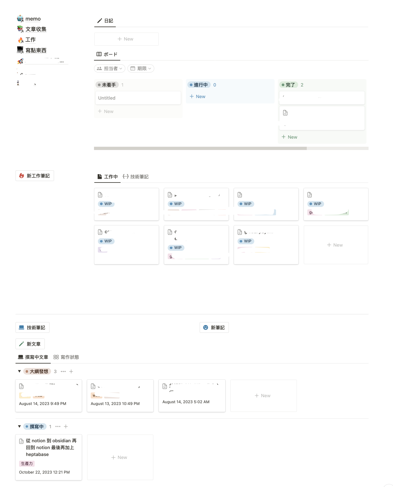

### 日記與 todo list

這邊就是切出兩個 column 然後一部分是放常用的連結讓我導過去其他的 page 或者 database ，然後就是放入兩個 database 一個是日記一個是 todo list。

### 工作筆記

工作筆記比較像通常是我在開發某個功能或產品時會用到，通常筆記規模會是一個 feature 那我開發時遇到什麼問題或者開會上有提到哪些事情都會寫在同一頁。

### 文章撰寫進度

這邊就是完全為了部落格而設計的區塊了，簡單來說就是讓我總覽一下現在有哪些文章寫到什麼進度。

暫時解決我下次要找一個筆記或者要寫一個筆記時要先找是哪個 database 這件事情後，那下一步就是解決 database 過多的問題。

## 整理 database

### 文章收集

我將所有從網路上收集的文章都存到同一個 database ，然後用各種 tags 來分類，如果我想要快速瀏覽某種文章就可以用 view 來幫我 filter。

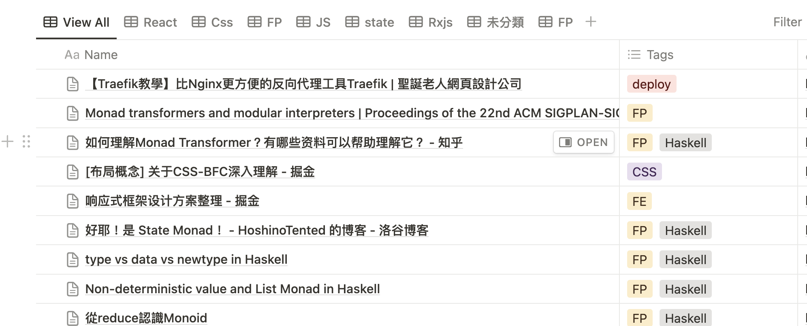

這部分我是使用 [save to notion](https://www.savetonotion.so/) 這個瀏覽器插件來簡化這個過程，我覺得他比官方的插件好用不少，因為它可以在存文章時就可以選擇 tags 或其他 properties，但官方插件我還需要去 database 裡一個一個加上 tag

### 筆記整理

然後我將不管是個人生活相關或者技術之類的事情都放在同一個 database ，但其實這邊還有一個值得改善的點是其實我感覺工作的筆記也可以放進這個 database。但因為後來 heptabase 的導入這部分我就先放置了。

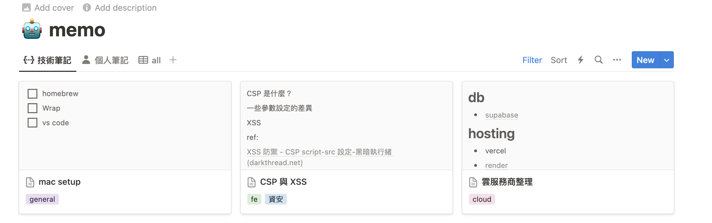

## 改善筆記的撰寫流程

因為後來得知了 notion 也有 backlink 所以後來我都是在日記上去連結到特定的筆記或文章

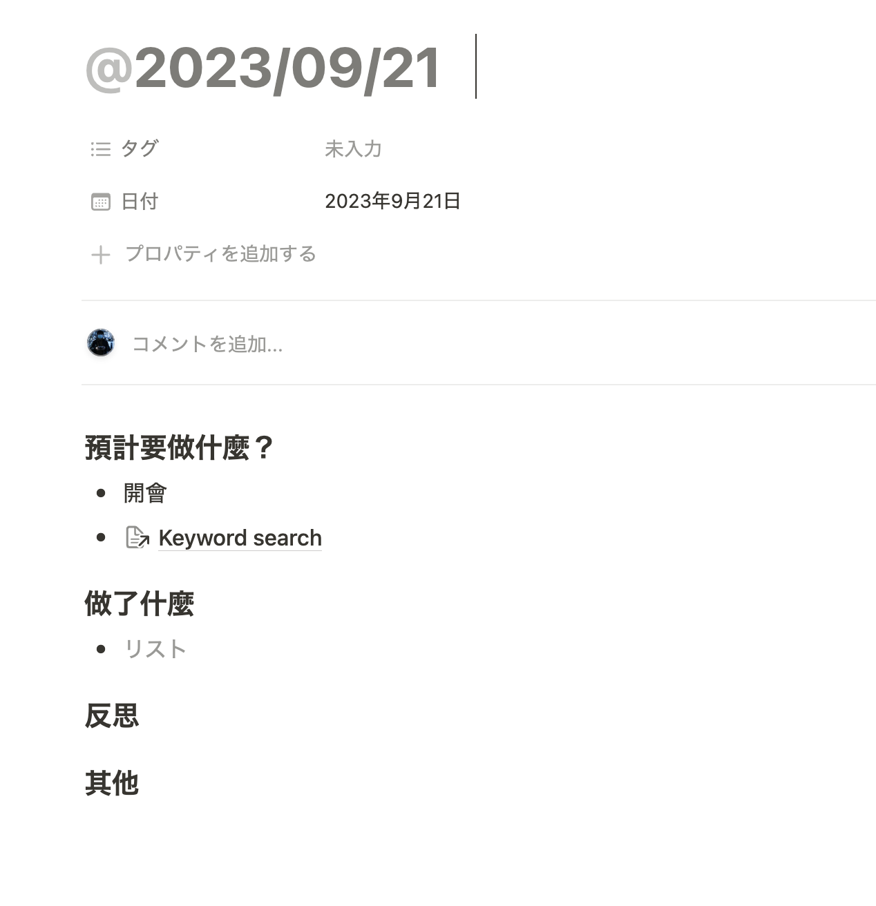

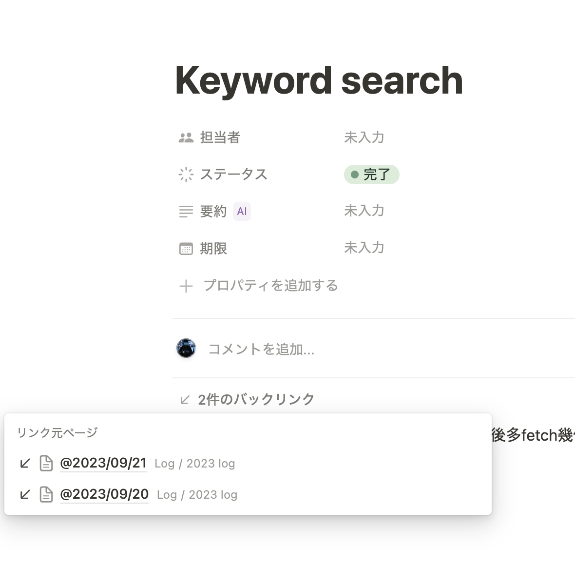

這邊就有點像我原本在 obsidian 的使用方式了，只是 obsidian 使用起來比較舒服就是了。

## 提醒機器人

為了解決我時常把文章存起來之後就再也不看的壞習慣，我決定寫一個小程式每天提醒我該看一下我目前存的文章。

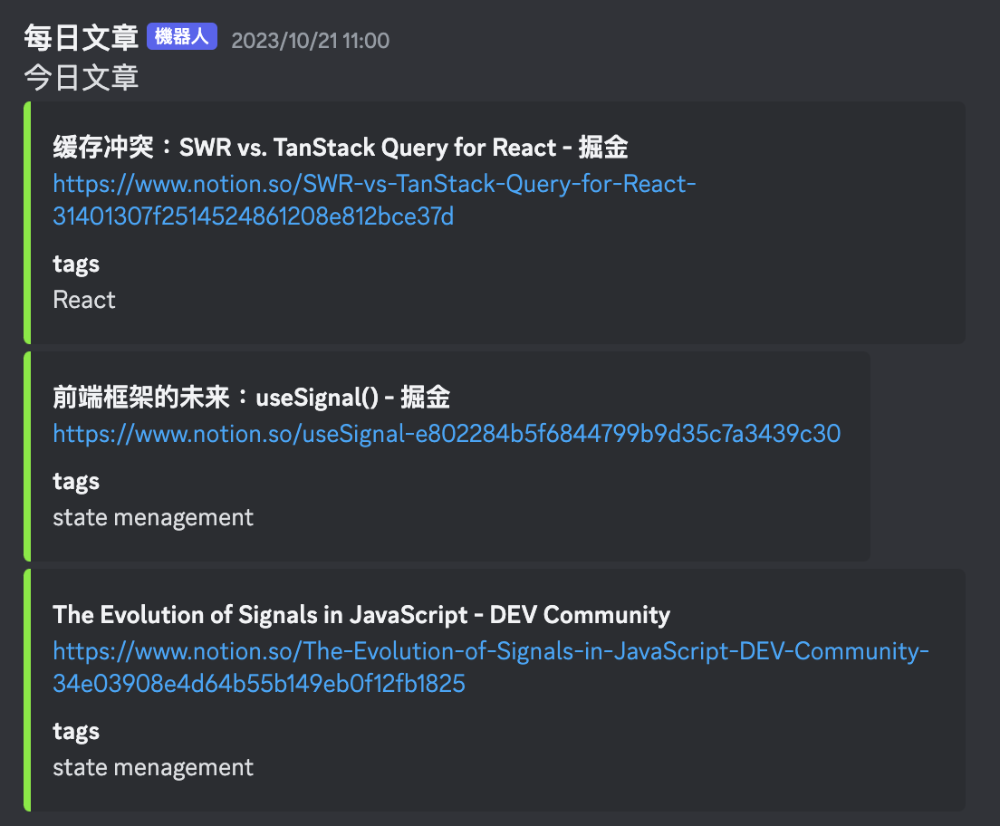

這部分就是用 cloudflare worker以及 discord 的 webhook 就可以簡單達成了，詳細的實作之後有機會再寫成文章跟大家介紹xD

但也因為是簡單的小程式所以我就沒有做一些 ranking 的機制，就真的只是隨機抽出三篇文章而不會根據他已經被抽出幾次或者哪些主題太常被抽出來而降低優先之類的設計。

原本這篇文章大概就到這裡結束只是後來在機緣巧合下得知了 heptabase 這個軟體，試用之後驚為天人就直接刷下去了。

> 可惜知道的太晚，那時早鳥優惠剛過沒多久。
> 

## 遇見 heptabase

簡單介紹一下 heptabase ，最主要的點是將各種筆記或者該說是知識、想法變成「卡片」然後在各個「白板」中組合出一個新的結構。

> 可以看一下他們創辦人對於這三個軟體的比較 [Heptabase vs Notion vs Obsidian](https://alanchan1209.medium.com/heptabase-vs-notion-vs-obsidian-3d1740c7745#6687)
> 

這跟我使用 notion 時的想法完全不一樣，因為通常我是先想「我該寫在哪裡」之後在開始寫筆記。而 heptabase 可以讓我「先寫就對了」之後再看怎麼整理。

我現在都會習慣先全部都寫在 Journal 然後累積到一定程度再去把這些文字轉換成卡片，那這件事情在 heptabase 非常容易做到，我只要打完字然後拖曳過去白板就會是一張卡片了。

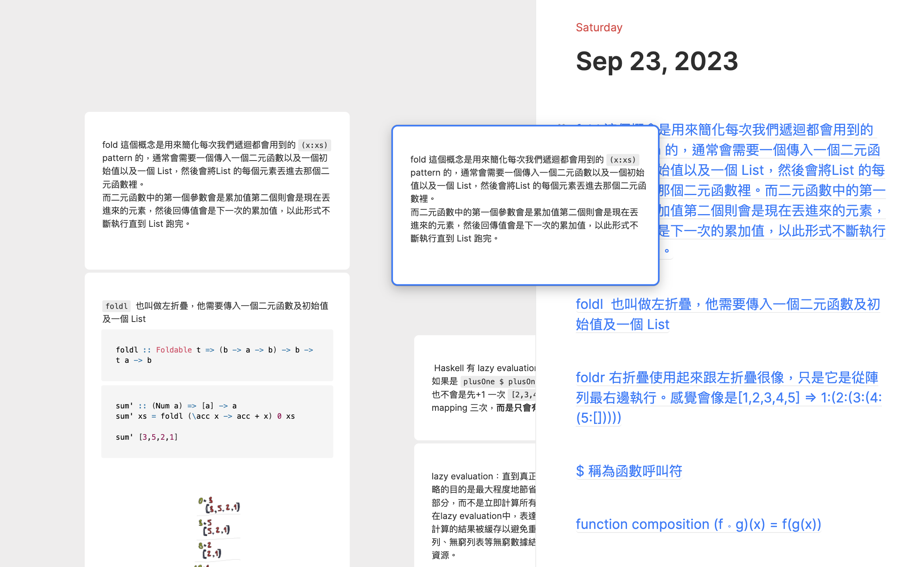

在 heptabase 中「白板」我們在閱讀筆記以及整理知識最主要的地方

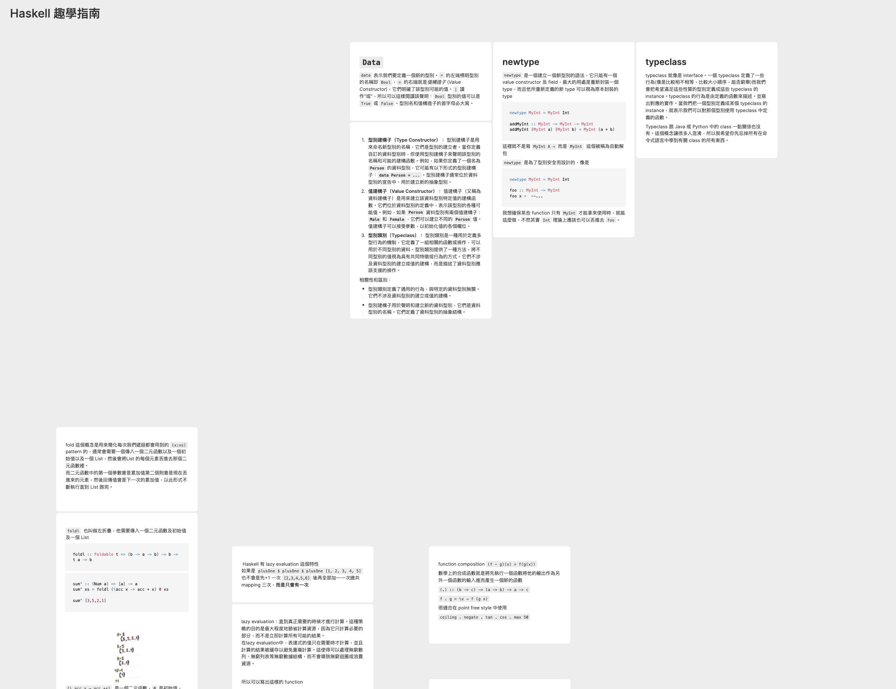

我覺得這裡最有感的地方是它讓我們可以一次瀏覽所有有關的知識，而且我們也可用顏色或者箭頭來表達這些卡片的關聯。

當然 heptabase 其實不只卡片這個 item ，未來有機會再另外寫一篇文章介紹我用到 heptabase 的哪些功能xD。

# 現況

經過這陣子的摸索我得出一個結論

**不要妄想一個軟體可以做到所有事情**

我目前就是變成 heptabase 為主，notion 為輔的筆記系統，因為他們各有強項誰也無法完全取代誰，hetpabase 適合撰寫筆記、整理想法，notion 適合存放文獻、收集資料。

所以目前我大部分有關「寫」這件事情都會在 heptabase 上處理，除了寫 blog 以外，畢竟寫 blog 文章還算是一個比較有規則的寫作，只是我在寫 blog 的當下另外一個螢幕就會是看 hetpabase 關於我這次想寫的主題的相關知識，而不用像以前一樣要在 notion 大海撈針。

其餘不管是收集網路文章、旅遊景點、購物清單等等這種適合「用表格呈現」的行為我就會在 notion 裡處理。

# 結語

我非常認同 heptabase 團隊對於這個軟體的看法「比起一個筆記軟體，它更像一個學習軟體」，只是因為大部分時候我是透過筆記學習所以並沒有特別在乎兩者的差異，但用了 heptabase 之後我覺得我在複習一個知識時變得更加輕鬆，總而言之我非常推薦這個軟體，除了軟體本身好用以外 heptabase 非常認真在經營使用者社群。他們的 cs (其實我不確定是不是這個職稱，但總之就是負責客戶關係的成員)，前陣子開始預約諮詢的活動，可以跟他討論有關 hetpabase 各種事情。我後來也有跟他約時間討論看看，我覺得十分有幫助畢竟這個軟體其實有那麼一點複雜，但我覺得複雜的點是因為跟過去習慣的概念不太一樣，但我覺得只要試著採用他們建議的使用方法體驗會好非常多。

在**回到Axton**這個 yt 頻道聽過這麼一段話原文有點忘了，大意大概是：

**「最享受的浪費時間方式，就是研究各種提升效率的方法」**

只能說，確實，其實現在我想做的事情用 notion 也許可以符合，但就是沒有那麼舒服而已。